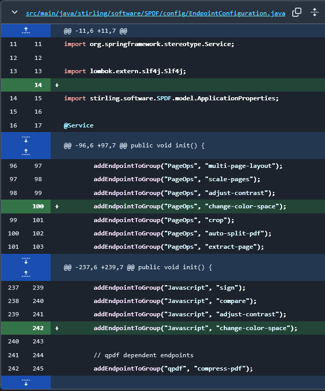
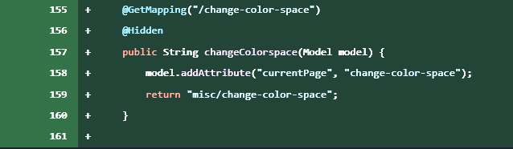
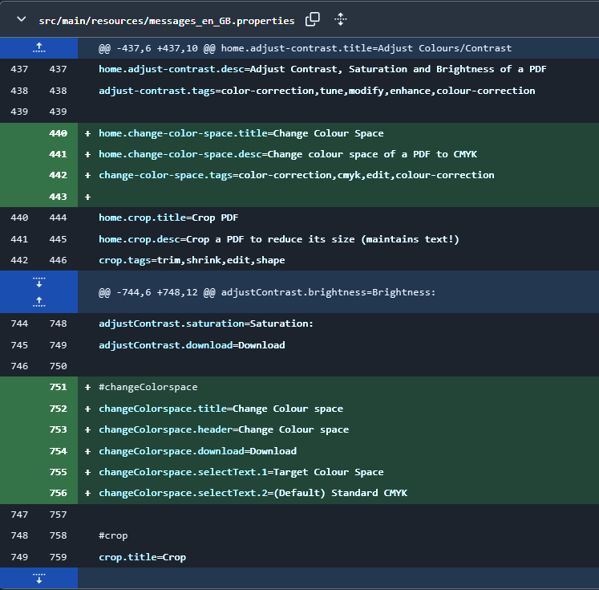
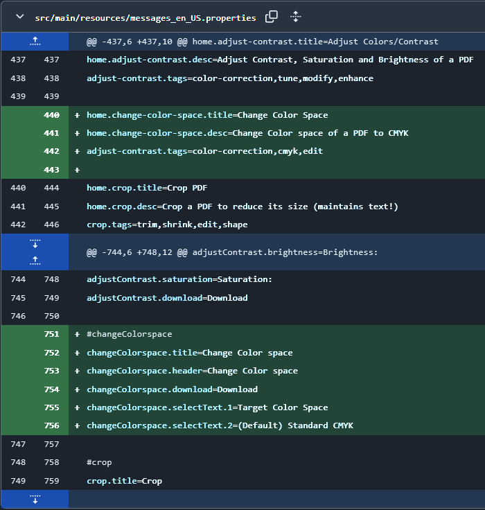
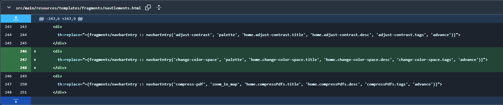
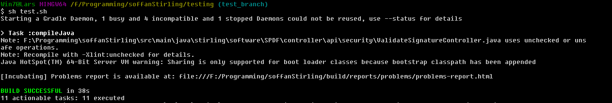
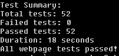
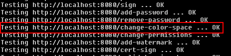

# Report for assignment 4: Issue resolution
This report covers Assignment 4: Issue Resolution, as part of the course DD2480 Software Engineering Fundamentals. The full assignment description can be found in the [task description](https://canvas.kth.se/courses/52568/assignments/320347). 

Group 3: Adam Åström, Hanna Sennerö, Janne Schyffert, Oskar Grönman och Pontus Filén.

## Project

Name: Stirling-PDF

URL: https://github.com/Stirling-Tools/Stirling-PDF 

Stirling-PDF is a web application (localy hosed) that can be used for various PDF operations. It offers a wide range of features such as converting, merging and compressing PDF-files.

## Onboarding experience
We chose to switch projects for this assignment from the project we had in assignment 3. We made this decision mainly because of the onboarding experience. The previous project was very difficult to get running, and we spent hours trying to understand how to execute it and fix error messages that prevented compilation.

This project was much more simple to get working than the last project. The documentation was extremely clear, with instuctions for both using the software and for different types of development. Step-by-step instructions were provided on which programs needed to be downloaded and how to build and run the program. In their user guide, they explained Compose first, followed by build, which might lead to some confusion for someone who is not familiar with Docker, but it doesn’t necessarily need to be updated in the documentation since it could be seen as basic knowledge that the user is expected to have.

## Effort spent
Below is a breakdown of the time each team member spent in different activities.

### Adam
1. plenary discussions/meetings; 2 h
2. discussions within parts of the group; 2 h
3. reading documentation; 3 h
4. configuration and setup; 30 minutes
5. analyzing code/output; 4.5 h
6. writing documentation; 5 h
7. writing code; 5 h
8. running code; 4 h

### Hanna
1. plenary discussions/meetings; 2 h
2. discussions within parts of the group; 2 h
3. reading documentation; 4 h
4. configuration and setup; 30 minutes
5. analyzing code/output; 4.5 h
6. writing documentation; 6 h
7. writing code; 5 h
8. running code? 4 h

### Janne
1. plenary discussions/meetings; 2 h
2. discussions within parts of the group; 2 h
3. reading documentation; 4 h
4. configuration and setup; 4 h
5. analyzing code/output; 5 h
6. writing documentation; 2 h
7. writing code; 1 h
8. running code; 5 h

### Oskar
1. plenary discussions/meetings; 2 h
2. discussions within parts of the group; 2 h
3. reading documentation; 4 h
4. configuration and setup; 30 minutes
5. analyzing code/output; 5 h
6. writing documentation; 2 h
7. writing code; 5 h
8. running code; 5h 

### Pontus
1. plenary discussions/meetings; 2 h
2. discussions within parts of the group; 2 h
3. reading documentation; 3 h
4. configuration and setup; 30 minutes
5. analyzing code/output; 4.5 h
6. writing documentation; 5 h
7. writing code; 5 h
8. running code? 4 h

## Overview of issues and work done.

### Issue 1
Title: "Color space changes #1249"

URL: https://github.com/Stirling-Tools/Stirling-PDF/issues/1249 

This was a requested feature to change the color space of a pdf from the current one to another. Especially/most importantly from RGB to CMYK, since PDFs are often printed and CMYK is better for printing.

We are adding a new feature to the PDF tool that will convert PDFs from RGB to CMYK (or another color space specified by ICC profile). The scope of this may seem to be quite easy, it is only to convert from RGB to CMYK (which is quite easy). However, the hard part of the issue stems from the fact that we need to save it as a CMYK file in some ways. Javascript does not natively support this, and since we did not want to add more dependencies we had to settle for a back-end solution. 

Scope (functionality and code affected)?

Adding a feature requires adding multiple new classes, with all their contents, as well as adding a html site/template, updating existing references to account for the new feature and so on.

### Issue 2
Title: "[Bug]: Error message banner should disappear when a new file operation is performed  #2419"

URL: https://github.com/Stirling-Tools/Stirling-PDF/issues/2419

The bug occurs when you upload a broken PDF or a similar file (such as one with missing content). After selecting a random tool and uploading the corrupted PDF, an error will appear when the tool is run. Then, if you upload a new, correct PDF and run the tool again, the error message will still be visible. This is the issue that needs to be addressed.

Scope (functionality and code affected)?
Functionalities affected include the error banner appearing for the wrong file operations. Application would at times freeze in the event of the bug occurring. One method affected with the changes made to resolve the issue. 

## Requirements for the new feature

### Functional requirements
- Color Space Conversion: The primary requirement is to add functionality that converts PDF files from RGB color space to CMYK color space. 
- ICC Profile Handling: The tool should support the use of ICC profiles for color conversion. The system should accept an ICC profile and apply this profile to convert the RGB images to CMYK within the PDF.
- Image Handling: The color space conversion should be applied to image objects within the PDF. All images should be processed and converted to CMYK while maintain high quality.
- Text and Background Conversion: The color of text and any background elements should also be converted.
- API Integration: The new feature should be integrated with the existing PDF program as a new button. The user should be able to send a PDF file throught the program, and the program will return the modified PDF with the color space conversion applied.

### Non-Functional Requirements:
- Should be able to handle large PDF documents.
- Error handling: ensure that issues such as missing ICC profiles, unsupported PDF formats, or invalid color values are managed with error messages.

## Code changes
The code changes made to solve Issue 1 is presented below.

### Patch

#### Issue 1

Since the patch mainly implemented new classes and files, it would be easiest to look at them directly. Since everything in them are new.

These can be found at: 
- [ChangeColorSpaceRequest.java](https://github.com/Soffan-Group-3/Stirling-PDF/blob/1249-color-space-changes/src/main/java/stirling/software/SPDF/model/api/misc/ChangeColorSpaceRequest.java)
- [ChangeColorSpaceController.java](https://github.com/Soffan-Group-3/Stirling-PDF/blob/1249-color-space-changes/src/main/java/stirling/software/SPDF/controller/api/misc/ChangeColorSpaceController.java)
- [ChangeColorSpaceService.java](https://github.com/Soffan-Group-3/Stirling-PDF/blob/1249-color-space-changes/src/main/java/stirling/software/SPDF/service/ChangeColorSpaceService.java)
- [ChangeColorSpace.java](https://github.com/Soffan-Group-3/Stirling-PDF/blob/1249-color-space-changes/src/main/java/stirling/software/SPDF/utils/ChangeColorSpace.java)
- [change-color-space.html](https://github.com/Soffan-Group-3/Stirling-PDF/blob/1249-color-space-changes/src/main/resources/templates/misc/change-color-space.html)

However, these are not the only changed we have made. There are some changes that are needed to be made in order for `Springboot`, `Thymeleaf` and the program in general to work as expected. The changes for these files are as follows:

##### EndpointConfiguration.java

#### OtherWebController.java

#### messages_en_GB.properties

#### messages_en_US.properties

#### navElements.html

There is an automatic formatter that is applied when one runs the project. This is great, since it makes all of additions follow the correct specification. However, as an unfortunate side effect this formatter sometimes makes changes to methods, whitespace and code that we have not touched. This can easily be avoided for files we have not changed by not adding them to the `commit`. However, if there is a file we have changed it becomes a little harder to notice. 

#### Issue 2

For issue 2 the [pull request](https://github.com/Stirling-Tools/Stirling-PDF/pull/3114) have been merged and accepted into main!

## Test results
The first image shows that it passed all of the Java tests, otherwise the build would fail and it would say which test that failed.

These images shows that all webpage tests were passed successfully!

### Test case relevancy.

The test cases we have added tests for the following test Functional Requirements (all of them):

- Color Space Conversion
- ICC Profile Handling
- Image Handling
- Text and Background Conversion
- API Integration

It would maybe be more accurate to create sub-groupings out of these requirements. Since some of them can be seen as sub-requirements of others. For example, the first functional requirement would be impossible to achieve if `Image Handling`and `Text and Background Conversion` have not been fulfilled. Since as a part of converting a pdf to CMYK we have to convert all of its objects to CMYK, since a pdf is essentially only a collection of objects. This means that if we test for `Image Handling` and `Text and Background Conversion` then this requirement would be automatically be fulfilled.

Furthermore, all of our tests uses ICC profiles (and actually all of our functionality) in order to convert one color to another. This means that our service in itself would not work if ICC Profile handling was not handled (and fulfilled). Therefore, we get that this requirement is fulfilled/tested by our tests (since they successfully transform colors).

Now we have to show that our tests test the requirement `Image Handling`. Tests that test this can be done in multiple ways, with the easiest being to have some pre-existing images saved to disk and trying to convert them. However, in the spirit of the project this is not done to minimize the amount of files used. Instead we manually create images and add some RGB color to them. Then we insert these images into a pdf. After this we use our functions in order to convert the images in the PDF to a new PDF. At this point we iterate through the new PDF and check for all images that the resulting new image has the correct CMYK values! This will check that:

1. Images are converted to correct CMYK colors 
2. All images are properly handled
3. That the pixel values remain unchanged and high quality.

To show that our tests cover the requirement `Text and Background Conversion` is relatively simple. What the code essentially (in short) does is that it replaces all "rg" and "RG" (with their related color values) into "k" and "K" (with their related color values). Therefore, what the test does is simply construct a pdf, with known colors and RGB space. Converts these colors into CMYK with our ICC profile and methods. Then it reads through the new PDF and makes sure that all "rg" and "RG" has been replaced with "k" and "K", while the colors are accurately depicted.

Lastly we have to test for the requirement `API Integration`. Half of this can be quite hard to test for automatically, since it can be a little hard to make sure that a button for example exists. However, what we can do is to automatically go to the website (check if it exists) and try to do a dummy POST request. This is easily done with `Stirling PDFs` already existing testing suite, and only a couple of lines are needed. What this does is that it makes sure that the website exists, and that it responds to POST requests in the correct way! Since the other tests (and requirements) pass, we will also know for sure that the PDF is correct. Therefore also satisfying this requirement!

## UML class diagram

### Key changes

#### Issue 1
The key methods added were the following:
- ChangeColorSpaceRequest – Uses ICC profiles.
- ChangeColorSpaceController – Handles HTTP requests.
- ChangeColorSpaceService – Responsible for changing the color space of images in a PDF.
- ChangeColorSpace – Performs the color conversion.
- PDDocument (from PDFBox) – Represents the PDF document.
- PDImageXObject – Handles image objects within the PDF.
- ICC_Profile and ICC_ColorSpace – Represent color profiles.
- 

#### Issue 2
The method changed was:
- decryptFile(file, requiresPassword) in the src/main/resources/static/js/DecryptFiles.js.
- Changes includes ensuring that the removeErrorBanner() is called before the await call.

##### Relation to design pattern(s)

During our development, we tried our best to stick to the design patterns that are already used in the project. In order to get a MVP we started with copying other files, and using their code. This automatically leads to a lot of the code sharing a lot of similarities to the already existing one. There is as stated also an automatic formatter, which when building/running the project automatically formats much of the code to be correct. This formatter seems to be quite advanced since it has multiple times changed lines of code to another (newer) version, that does the same thing. These two things make it easier to keep the new changes to the already existing design pattern.

However, in this project it is in places quite obvious that it is a open source project. Naming conventions and file structures are routinely used differently in different places. In some places it is expected to have different naming conventions. For example, the Java code uses camelCase as is standard for Java, while the front-end code usually uses hyphen connected names (E.g `test-variable`). The problem in naming conventions arises when front-end variables will be used by the back-end. In this case the variables are most often written in camel case, but not always. This kind of confusion occurs at multiple places in the project, however, we have tried to keep with the most used and popular patterns.

Since we added a new `feature` we have closely followed the [Developer Guide](DeveloperGuide.md). This clearly describes how to add a feature (and a new front-end for that feature) in a way that is consistent with the already existing Architecture. For example this is having separate classes for the `controller`, `service` and `request` (and having them in their correct places). For example the `controllers` are quite short, and should only call methods, and not really do any calculations itself (usually). The `request` class has information about the received `POST` request, with any additional information that may be needed. In our case this was the name of an ICC Profile, which we defined using a `Schema`. The `service` methods are a bit mixed about how they go about running their code. Some of them have many functions and call classes/methods in the `utils` folder, while others have most of the code in the service. We tried to use the same pattern as in `PdfImageRemovalService.java` since for one of our methods we also need to iterate over all images. Therefore the use case of these are very similar and therefore makes sense to share the same design patterns. The pattern is that the most of the job is done in the service, while helper methods and similar have been moved into a specific class in the ´Utils´ folder. We extended this thought into when we made the method that iterates over all tokens in the pdf and changes colors to the provided color space. Here we have one big method that does most of the work, much like in `PdfImageRemovalService.java`. However, the scope of these methods are a little bit different, since the `changeColorSpaceTextAndBackground` method is much bigger. Here it may have been better and more in line with the design patterns to break out some of the code into a helper function in a class in the `utils` folder.

Probably the biggest design pattern we broke, at least to our knowledge, is the way we are currently handling ICC profiles. Right now we have them saved as a specific file, which we then load at runtime. This is not something we have seen in any other part of the project. It may simply be because they do not need to load other files. There also seems to be no other real option, except for letting the user provide their own ICC profile which has its own drawbacks. 

## Overall experience

What are your main take-aways from this project? What did you learn?

How did you grow as a team, using the Essence standard to evaluate yourself?
Right now we are mostly in the Collaborating Stage rather than the Performing Stage because we’ve built a strong foundation open communication, and teamwork. We work well together as a unit, and everyone is aligned with the shared mission. Ideas are exchanged freely, and we support each other to get things done.

However, we still have some room to improve when it comes to efficiency in order to reach the Performing Stage. At times, we find ourselves not having divided the work clearcly enough, which may lead to two people working on the same thing at once. Thus we are still working on our ability to spot and eliminate wasted effort before it happens. While these things don’t hold us back too much, however, fine-tuning these areas will help us transition into the Performing Stage, where we could work at our highest level with minimal setbacks.

### Critical Evaluation

Currently our implementation satisfies most/all of the functional requirements to at least an acceptable standard, or in some cases even addressed. We have for example ensured that we use lossless image formats when converting images and that all color elements on a pdf is transformed. There is the possibility that there are some edge cases where our `service` does not realize that there is some color that it should change. Theoretically, this should be next to impossible, since all colors have to be specified somewhere in the document. However, to transform the color spaces the pdf **has to be** in the RGB format (not for images). This can in some cases not be ideal, for example if one would want to revert a change that the service has done. 

Regarding the non-functional requirements there should be no problems. Large pdfs are for example the same as small pdfs, just larger. Therefore, if it works for small there should be no upper bound for when it stops working (at least until the rest of the project stops working). However, our solution has to walk through each token in the PDF to accurately change all of the colors. For large pdfs this would require a huge amount of iterations, and may in some contexts be too slow. 

This mainly factors in to the `Software system` area/alpha. Our work currently fulfills the `usable` state, since the system is operable, tested and has (in most cases) an acceptable performance. There is one small change that could be made to increase the performance of the service. This would be to merge the two functions of the service, especially since we are only using them in conjunction. This would make us only need to iterate over each page of the pdf once, which could for large pdfs be a noticeable performance gain. However, this would lower the modularity of our service. Right now it is very easy to add functionality that would allow the system to only convert images, or only convert text. This would be lost if this was made. 

Furthermore, (almost) all of the added code has the same level of documentation (if not more) than the already existing code. However, it is known that some comments have not been changed to accurately display the latest changes. For this reason the project does not fulfill the `User documentation available` criteria. In this case the step between `Ready` and `Operational` is very short. The system would be in the `Ready` state if its related Pull request got accepted, however, if the pull request got accepted it will also be `Operational`. 

A critical evaluation of the design has already been made.

